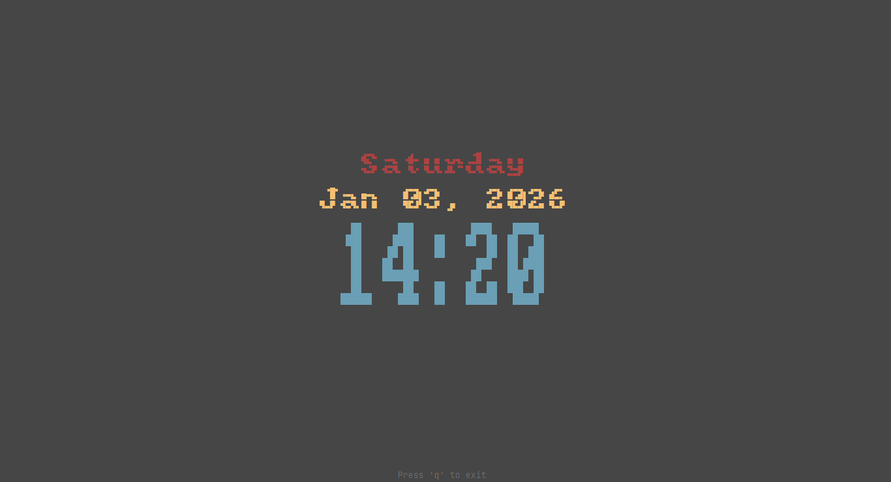

# Term Clock

This little project is a simple terminal digital clock



#### Why ?

I wanted a nice way to display the time on my secondary monitor (especially when I'm gaming).

- Tried [tmux](https://github.com/tmux/tmux)'s clock-mode, it does the job but goes away as soon as the terminal loses focus.
- Tried some other terminal clock apps, most of them were too complicated and/or displayed too much info.

So I decided to make my own.

## Goals

- Display the time (and optionally the date) in the terminal
- Have a big, nice-looking font

## Installation

To install this you first must install [Rust](https://www.rust-lang.org/tools/install)

```sh
# clone this repo
git clone https://github.com/benjiewheeler/rust_journey.git

# cd into the term-clock directory
cd rust_journey/term-clock

# install
cargo install --path .
```

## Used Crates

- [chrono](https://docs.rs/chrono/latest/chrono/) for getting the date and time
- [clap](https://docs.rs/clap/latest/clap/) for parsing command line arguments
- [crossterm](https://docs.rs/crossterm/latest/crossterm/) for terminal manipulation
- [ratatui](https://docs.rs/ratatui/latest/ratatui/) for terminal UI
- [tui-big-text](https://docs.rs/tui-big-text/latest/tui_big_text/) for displaying big text
